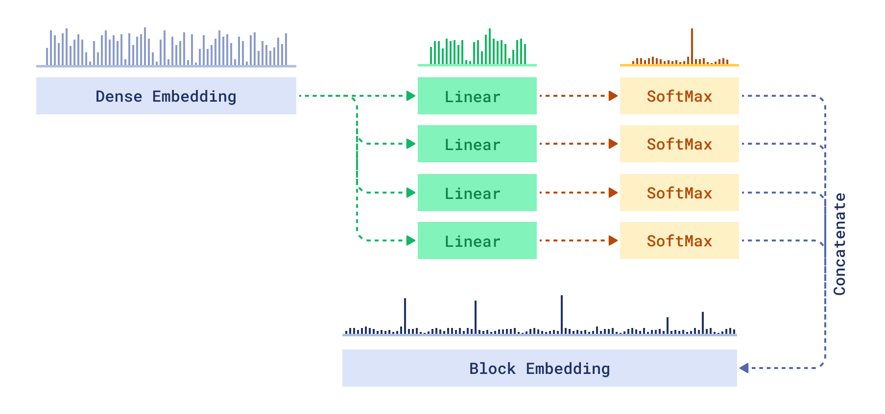

# Block Embeddings

This project is a proof of concept of a technique of dense embeddings transformation, which is aimed to amplify dataset-specific features of the embeddings.

The main idea of this approach is based on the usage of `SoftMax` function. In traditional classification tasks, SoftMax is used to convert logits to probabilities.
In this case SoftMax amplifies the most significant component of the input vector, while keeping the whole output vector normalized.

This propoperty is usually used to estimate confidence of the classifier predictions.


Single SoftMax function is, however, not enough to represent information about the object with dense embeddings.
Dense embeddings contain information about many different features of the object, which might occure at the same time, while SoftMax will amplify only one of them.

To address this issue, we can use multiple SoftMax functions, each of which will amplify a different feature of the object.

The idea is to split the embedding into multiple blocks, and then apply SoftMax to each block separately.



## When it can be useful?

* **Estimate confidence of the embeddings** 

By the analogy with classifier confidence, if the probability score of the features is low, embedding is most likely no fit for the collection.


> On this example we can we have block embeddings trained on a food dataset.
>While picture of a car is a valid input for the underlying model (CLIP), it is a clear outlier in the food dataset.
>Difference in confidence is clearly visible on the plot.


* **Conversion to sparse embeddings**

Amplified features contain the most important information about the object, so we can use them to create sparse embeddings.
This embedding won't be as accurate as the original one, but it can be used for fast pre-fetch of candidates.

```
Threshold: 0.1

Sparse vector for cake: {17: 0.12, 47: 0.18, 88: 0.16, 109: 0.18, 130: 0.42, 235: 0.11}
Sparse vector for pizza: {17: 0.2, 109: 0.67, 235: 0.29}
Sparse vector for car: {}
Sparse vector for sushi: {20: 0.14, 45: 0.23, 76: 0.57, 191: 0.15}
```

* **Enchanced understanding of the embeddings**

By studying which features are associated with which objects, it might be possible to come up with interpretable description of some features.

* **Advanced recommendations**

Having a set of interpretable features, it might be possible to tune query to point the search to the desired direction.
In combination with other techniques, like [exploration search](https://qdrant.tech/articles/vector-similarity-beyond-search/#discovery), it might be possible to build personalized search and recommendation systems.


## Setup

This project uses `uv` for dependency management. To get started:

1. Install `uv` if you haven't already:
```bash
pip install uv
```


```bash
uv sync
```

## Usage

To train spectral model on your own Qdrant collection:

### Prepare data

First step is to obtain similarity matrix from Qdrant collection. This step will use Qdrant API to obtain similarity matrix for a subset of the collection.

```bash
export QDRANT_URL=http://localhost:6333
export QDRANT_API_KEY="" # your API key

uv run python -m embeddings_confidence.load_data --collection_name food --sample 20000 --limit 100 --using embedding
```

```bash
usage: load_data.py [-h] [--collection_name COLLECTION_NAME] [--output_name OUTPUT_NAME] [--sample SAMPLE] [--limit LIMIT] [--using USING]

options:
  -h, --help            show this help message and exit
  --collection_name COLLECTION_NAME
                        Name of the Qdrant collection to use
  --output_name OUTPUT_NAME
                        Name of the output file. Result will be saved to data/{output_name}.npz, and data/{output_name}_vectors.npy
  --sample SAMPLE       Number of points to sample
  --limit LIMIT         Number of closest neighbors to consider
  --using USING         Name of the vector field to use for search. If not provided, default vector field will be used.

```

For training of the model you would need 2 similar matrices: one for training and one for validation.
By default, the training script expects the following locations:

```
data/similarity_matrix_train.npz
data/similarity_matrix_train_vectors.npy

data/similarity_matrix_val.npz
data/similarity_matrix_val_vectors.npy
```

### Train model

Training script will use similarity matrix as a target for the model loss function.
Vectors will be used as input to the model.

```bash
uv run python -m embeddings_confidence.train --epochs 20
``` 

```
usage: train.py [-h] [--epochs EPOCHS] [--log_dir LOG_DIR] [--lr LR] [--factor FACTOR] [--patience PATIENCE] [--output_path OUTPUT_PATH]

options:
  -h, --help            show this help message and exit
  --epochs EPOCHS       Number of epochs to train for
  --log_dir LOG_DIR     Path to save the logs
  --lr LR               Learning rate
  --factor FACTOR       Factor to reduce learning rate
  --patience PATIENCE   Number of epochs to wait before reducing learning rate
  --output_path OUTPUT_PATH
                        Path to save the model
```

Once the model is trained, it can be used to convert original embeddings.

Example:

```python
encoder_path = os.path.join(DATA_DIR, "encoder.pth")

encoder = BlocksEncoder(
    input_dim=512,
    num_blocks=BLOCKS,
    output_dim=BLOCK_SIZE,
)
encoder.load_state_dict(torch.load(encoder_path, weights_only=True))
encoder.eval()

embedder = ImageEmbedding(model_name="Qdrant/clip-ViT-B-32-vision")

embeddings = np.array(list(embedder.embed([image_path])))
blocks_embeddings = encoder(torch.from_numpy(embeddings)).detach().numpy()

```